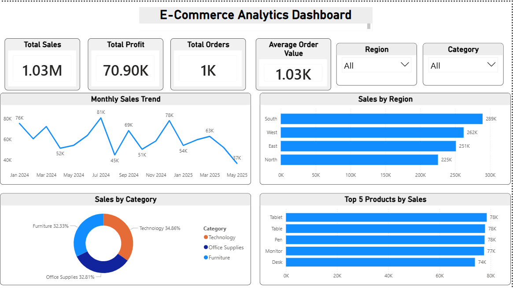

# E-Commerce Sales & Customer Insights Dashboard

## Project Overview
This Power BI dashboard analyzes e-commerce sales performance, customer insights, product trends, and regional sales distribution.

The project converts raw business data into interactive visual insights for business decision-making.

---

## Features
- KPI Cards for Sales, Profit, Orders, and Average Order Value
- Monthly Sales Trend Analysis
- Region-wise Sales Comparison
- Category-wise Sales Distribution
- Top Selling Products Analysis
- Interactive Slicers and Filters

---

## Tools & Technologies Used
- Power BI
- Power Query
- DAX
- Data Visualization
- Business Intelligence

---

## Key Insights
- Technology category generated the highest sales
- Regional sales performance varied significantly
- Monthly trends showed fluctuating sales patterns
- Top-selling products contributed major revenue share

---

## Dashboard Preview

---

## Author
Akanksha Aher
